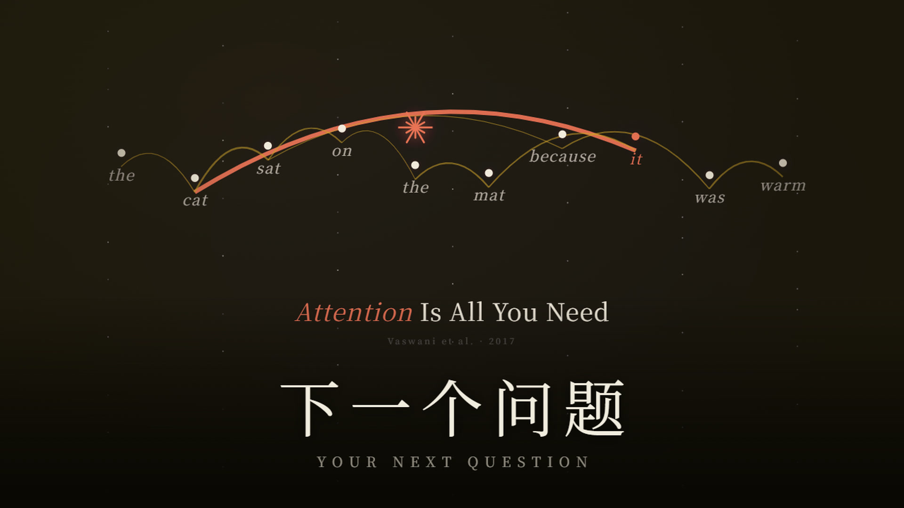

# 下一个问题 · Your Next Question

一个人 + 四个大模型，用代码渲染的一部 3 分钟短片：**四万年前有人第一次抬头，
四万年后按下回车的是你。**

整部片子没有一个镜头是拍的，也没有一帧是"手 K"的 —— 13 场的时长、字幕锚点、底图
prompt、动效参数、调色层、混音窗口，全部由一份 JSON 说了算，代码照着它渲染。

▶ **成片**：[`06_output/下一个问题-ep01.mp4`](06_output/下一个问题-ep01.mp4)（180.00s / 1280×720 / 30fps）



## 三层混合的画面

| 层 | 来源 | 例 |
|---|---|---|
| 底图 | 生成式模型出图，人工逐张判定打回重抽；S01 / S03 再走一次图生视频 | 星空、沙丘、洞穴岩壁、电报机 |
| 矢量图形 | 代码画 | 摩尔斯点划、螺旋星系、甲骨裂纹、沙堆剖面、注意力连线 |
| 文字排版 | 代码排 | 铭牌、双语字幕、落版 |

一个珊瑚色 ✳ 是全片唯一的暖色强调，从第一场的星，一路落到最后一场的手印上。

## 多模型分工（这个项目真正的看点）

| 角色 | 模型 | 干什么 |
|---|---|---|
| 项目管理与签发 | Kimi K3 | 审方案、提否决项、签发预算 |
| 剧本与创作 | GLM-5.3 完整版 | 26 条字幕、分镜文案 |
| 视觉审查闸门 | GLM-5.3-Flash | 逐场 6 维打分 + 史实溯源 |
| 工程与执行 | Qwen3.8-Flash（Qoder） | 渲染流水线、QC 脚本、装配混音 |

它们互相审、互相驳回。全过程的原始记录有几十份，按"只留能代表各角色立场"的原则
精简为根目录的 6 份：总体方案（含两次勘误）、任务书、GLM-5.3 完整版复审、审片问题汇总、
质量改进方案 v1 + v2（含两份"我自己推翻自己"的自审）。没有美化，删减处均留有结项注。

## 仓库结构

```
01_research/     facts.json：每条史实的出处 URL 与证据等级
02_script/       剧本 v2.4（逐条字幕 + 修订记录，含三次片名更定的拍板原文）
03_storyboard/   ep01.json ← 单一事实源，改这里而不是改代码
05_render/
  src/           Remotion 组件：kit.tsx（排版/调色原语）+ scenes/（13 场）+ cover.tsx
  tools/         流水线脚本（见下）
  public/        定稿底图（13 场 11 张图 + 2 支图生视频）
06_output/       成片、封面、示例帧
manifest.json    真实花费流水账
```

## 值得先读的四个脚本

| 脚本 | 解决什么 |
|---|---|
| `tools/ridge_mask.py` | 想"只让星空转、山不动"，先得知道山在哪。判据不能用绝对亮度（天空均值 16~43、山体 2~9，在 20 附近重叠），要用"又暗又没星" + 底边洪水填充，再压三条先验把左上角和火堆亮池的坑填掉 |
| `tools/sky_mask.py` | 把山脊以下烘成一张带 alpha 的**静止地面层**盖在转动层之上；再用逆映射逐像素判"星星有没有穿过山脊" |
| `tools/qc-sheet.py` | 暗部闸门：1% 黑位、死黑占比、过曝占比，按 dark/paper 分别判。**不许用肉眼判** —— 有 15%~22% 的像素是纯 0 的时候，缩略图上完全看不出来 |
| `tools/mix.mjs` | 两遍法 loudnorm 到 −16 LUFS；片尾淡出起点用"乐句气口"自动选谷，而不是硬编一个秒数 |

## 跑起来

```bash
cd 05_render
npm install
node tools/qc-stills.mjs S01          # 出该场 4 张事件帧
node tools/qc-sheet.py                # 全片数值闸门
node tools/render-scene.mjs S01       # 渲单场（务必一场一进程，见下）
node tools/assemble.mjs --mix ../06_output/mix.wav
node tools/cover.mjs                  # 出封面
```

需要系统里装了 Chrome（脚本用 `browserExecutable` 指向它，绕开 headless-shell 下载卡死）。
API key 从 `~/.qoder-cn/secrets/video.env` 读，**代码里不含任何密钥**，也不会打印它。

## 一些真实数字

- 全部 API 花费 **20 元出头**（生图 + 配音 + 图生视频），渲染本身 ¥0
- 底图抽卡命中率 **5.27 次 / 位**，11 个槽位抽了 58 张，**零一次通过**
- 图生视频 4 次里 **2 次是废片**：模型会在"运动主体"周围把星空**涂成无星雾区**（实测该亮像素占比从 0.08% 掉到 0.00%）。最后一支靠 prompt 里一句 `do not blur, fog, darken, erase, smudge or repaint any region` 才治好
- 一次全片重渲约 12 分钟；把 13 场塞进一个进程会在第 3–7 场撞 Remotion 内部服务崩溃
- 视觉审查抓出的问题里，**人类截图 > 数值闸门**：好几条闸门全绿的场，被一张手机截图否掉了
- **判断一场"有没有在动"，抽几张静帧是不够的**：S05 的摩尔斯码条原来只发 4 个字母、14 秒的场从第 4.2 秒起彻底冻住，四张事件帧全都"看着正常"。是画"每 0.2 秒一帧的区域时域 Δ 曲线"才抓出来的

## 许可

代码 MIT（`LICENSE-code.md`）；文案、画面、文档 CC BY-NC 4.0（`LICENSE-content.md`）。
**音轨不在这两份许可之内**，务必看 `LICENSE-content.md` 里的音轨声明。
